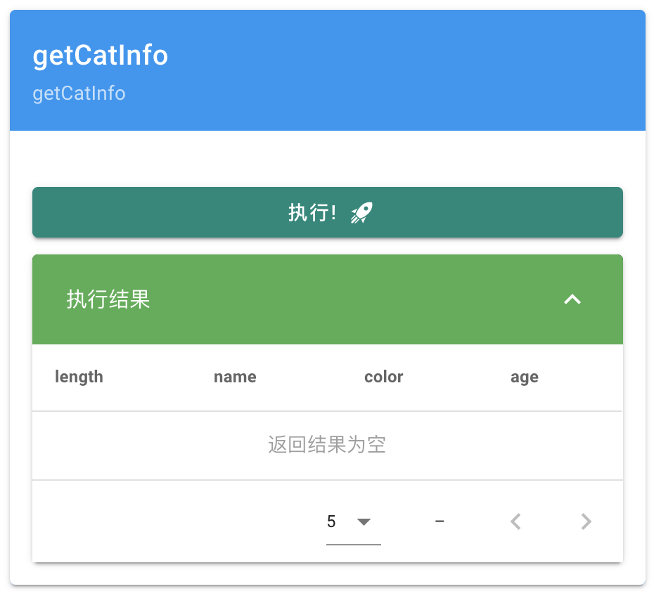

# MIAO
<a href="LICENSE">
    
</a>
  
- - -
中文 | <a href="./README-EN.md">EN</a>

## MIAO是什么？
MIAO ( ”Miao Is A web demO generator”的缩写，读音为/mjɑʊ/) 是一个非侵入式的网页演示生成器，能够快捷地将某个函数或者某段代码转化为网页界面，用以临时的演示或者测试，开箱即用而无需复杂的配置过程。

MIAO 并不是一个 Web 框架，其关注点与Web框架有着很大差异，MIAO 主要是用于制作一些临时性的小 Demo 或者小的在线工具，而不是被应用在生产环境中，也不建议被用于正式的项目中。

MIAO 在灵活性与易用性之间作了取舍，主要着眼于提供便捷的，开箱即用的临时网页小 Demo 生成功能，而不提供过多的配置与自定义界面/交互的功能，也不像Web框架那样，提供诸如「权限控制」、「路由」、「模板渲染」、「Session」等功能。
只需三步即可快速创建一个临时小 Demo：<br>
引入库->加注解->启动服务

MIAO目前仅支持 Java 和 Python，后续会加入对其他语言（如Golang,JavaScript,Haskell）的支持，敬请期待。

## 怎么使用？
**本工具尚未全部开发完成，目前仅能使用部分主要功能，其余功能的实现计划详见后文「规划路线图」章节**

（Python 版见：https://github.com/TheColdVoid/MIAO-python）
### Java 版：
**MIAO 仅支持在Java 1.8及以上的版本中运行**<br>
pom.xml（Maven）中加入：
``` xml
<dependencies>
    <dependency>
        <groupId>cn.voidnet</groupId>
        <artifactId>MIAO</artifactId>
        <version>0.0.10</version>
    </dependency>
</dependencies>
```

或者，您也可以去 Release 中下载 jar 并将其加入您项目的外部库依赖目录中

然后只需引入库，并在想要生成界面的函数（显然，只能是静态函数）上，打上@WebDemo 注解，
``` java
@WebDemo
public static int getRandomNumber(int min, int max) {
    return new Random().nextInt(max - min + 1) + min;
}
```
最后在 main 函数（或者其他您想要启动服务的地方）中，启动本工具的服务器端即可
``` java
public static void main(String[] args) {
    MIAO.start();
}
```
_（ start()函数将在执行时阻塞，因此您需将此行代码放在 main 中您的其他代码的后面，或者开一个新的线程供本工具提供服务。）_

就可以自动生成这样的临时 Demo：


输入参数后，点击「执行」即可执行，并获得返回值：


### 可视化结果
执行结果可以以「表格」的形式进行可视化（后续会增加其他的可视化形式选项，如「图表」「图片」「树」等）：
存储返回结果的类：
``` java
class Cat {
    String name;
    String color;
    Integer age;
    Integer length;
}
```
为函数加上注解（ visualization 为选择可视化形式的注解参数）：
``` java
@WebDemo(visualization = VisualizationType.TABLE)
public static List<Cat> getCatInfo() {
    return Arrays.asList(
            new Cat("花花", "花", 8, 46),
            new Cat("空空", "空", 17, 184),
            new Cat("黑黑", "黑", 7, 73)
    );
}
```
即可得到这样的「表格」形式的可视化结果：

（需要注意的是，**返回值的类中必须具有要显示的属性 Getter 方法**（可以用 lombok 等工具自动生成，或者手动编写），否则返回结果将无法正确地被序列化）

您也可以返回 List<Map<K,V>> 类型的结果，也一样可以获得和上面一样的可视化形式的返回结果，例如：
``` java
@WebDemo(visualization = VisualizationType.TABLE)
public static List<Map<String, String>> getCatInfo() {
    Map<String, String> map0 = new LinkedHashMap<>();
    map0.put("name", "花花");
    map0.put("color", "花");
    map0.put("age", "8");
    map0.put("length", "46");
    Map<String, String> map1 = new LinkedHashMap<>();
    map1.put("name", "空空");
    map1.put("color", "空");
    map1.put("age", "17");
    map1.put("length", "184");
    Map<String, String> map2 = new LinkedHashMap<>();
    map2.put("name", "黑黑");
    map2.put("color", "黑");
    map2.put("age", "7");
    map2.put("length", "73");
    return Arrays.asList(map0, map1, map2);
}
```

您如果只是想简单地将一个列表作为返回结果，MIAO 也是支持的，
例如：
``` java
@WebDemo(visualization = VisualizationType.TABLE)
public static List<String> voice() {
    return Arrays.asList("喵", "汪", "嗷");
}
```
可以生成如下的界面：


对于上述几种情况，您都可以手动指定表格中每行的元素类型，使 MIAO 在函数返回值为空表时，能正确地显示表头：
``` java
@WebDemo(
    visualization = VisualizationType.TABLE,
    tableRowType = Cat.class
)
public static List<Cat> getCatInfo() {
    return Arrays.asList();
}
```

（由于 Java 中的泛型类型擦除机制，MIAO 无法在通过运行期反射来获取返回值类型的泛型参数，因此无法根据返回值类型来自动推断表头，只能用这种方式来实现这个功能）

您也可以手动指定表头中的列名：
``` java
@WebDemo(
    visualization = VisualizationType.TABLE,
    tableHeaders = {"name","color","age"}
)
public static List<Map> getCatInfo() {
```
这个功能也一样可以被用来限制或筛选表格中要被显示的列：


### 其他定制项
当然，本工具也提供了一些简单的定制化选项，例如您可以修改函数名、函数简介、参数名等：
``` java
@WebDemo(
	value = "两数相加",
	description = "返回两个数相加的结果"
)
public static double add(
        @Parameter("操作数1") double opr1,
        @Parameter("操作数2") double opr2
) {
    return opr1 + opr2;
}
```


上方的标题也可以通过参数来进行修改：
``` java
MIAO.start("Cat Ear Switch Controller");
```


将来会增加更多的定制项（例如参数的选择方式、配色等等）

PS:如果您使用的是 Gradle，请在 repositories 中加入 mavenCentral()，再引入本库

**PPS:请您将要生成网页 Demo 的函数及其所在的类 设为 public，以规避 Java 反射限制**

**PPPS:如果您没有手动指定参数的名称而是希望界面自动获取参数的名字的话，您需要在编译参数中加入**`-parameters`**参数，否则javac在编译代码时会自动抹除参数名称，本工具就无法读取参数名称以在界面中显示了（只能显示 arg0,arg1,arg2….）**
**以IDEA为例：**


PPPPS:由于本工具**尚未全部开发完成**，现在暂时函数参数和返回值只支持基本数据类型，可视化形式只支持「表格」，后续将会加入对「图片」「图表」「复杂对象」「文件」「视频」「函数图像」等的支持，详见「规划路线图」章节

## 名字什么意思？
MIAO 是”Miao Is A web demO generator”的缩写，同时也是汉语中用来形容猫叫声的音节（喵，读作miāo），类似「meow」和「にゃ」(≧∇≦)。

平时提到这个工具的名字的时候，也可以称之为 MiaoLib，以避免产生歧义或者和猫叫声混淆。

## MIAO和Web框架的关注点的差异
MIAO 并不是一个Web框架，其关注点与Web框架有着很大差异，两者之间更多的是互补的关系。MIAO 主要关注的是如下场景下的应用：
1. 您想把某个半成品项目给同事或者朋友临时展示下，用命令行来展示的话，并不太直观，有时候也不太方便，尤其是对于不熟悉计算机的测试用户来说，也需要费一定的口舌去介绍命令行的使用方式，空洞的命令行界面并不适合临时性的展示用途。
而且如果你和演示观看者处于异地（比如上网在线展示），往往还需要远程桌面/会议软件一类的工具来辅助演示，过于麻烦。而为此写再写一个临时性前端应用的话，又未免太过浪费时间。
对于这种使用场景，您使用本工具生成一个临时 Demo，挂在服务器上（同一内网的话，挂在本机也行），别人在电脑或者手机上输入网址，直接就能访问您生成的临时 Demo，非常方便
2. 您研发了一个新的工具或者库（例如人脸识别，目标检测，等等），希望将学术成果转化成一个可以交互的演示程序，供其他人使用或者用作学术交流，您可以在您的 Python 或者 Java 代码上引入本库，自动生成网页 Demo（后续会增加对图表等的支持），而无需编写前端代码
3. 您想做一些在线使用的小工具，例如文字格式转化、人脸美颜、表情包制作、进制转换、文字识别、打标签工具等等，但是不太方便用前端技术（Web 或 Native）来进行开发，又或者您不太熟悉前端技术。您就可以用本库来完成前端界面的生成（后续会增加对图片/文件的上传和返回值的支持），而无需再特意写一个前端应用，节省您的开发成本。
4. 您在开发一些嵌入式应用（例如物联网，智能家具，等等），希望用户能够通过网页来远程访问您的应用进行一些简单的操作（例如开灯，关灯，调节亮度，等等）。 您就可以在支持 Python 的嵌入式设备（例如树莓派）中编写控制程序，然后引入本库来生成 Web 控制页面，手机端电脑端均可使用。节省您用于开发前端部分的成本。

## 一些实例
示例的代码请点击链接查看。
示例演示了一些可能的使用场景，
如果您有更好的使用示例，欢迎提 PR 或直接联系我，我将会将其加入本章节，谢谢。
### 使用场景示例（Java 版）：依赖格式 Maven 转 Gradle

[代码链接](https://github.com/TheColdVoid/MIAO-example/tree/master/java)
Demo 链接
### 使用场景示例（Python 版）：小工具合集

[代码链接](https://github.com/TheColdVoid/MIAO-example/blob/master/python/example_tool.py)
### 使用场景示例（Python 版）：学术成果展示

[代码链接](https://github.com/TheColdVoid/MIAO-example/blob/master/python/example_academic.py)
### 使用场景示例（Python 版）：物联网

[代码链接](https://github.com/TheColdVoid/MIAO-example/blob/master/python/example_respi.py)

## 规划路线图
以下功能将逐步被加进本工具中。如果您对本项目有兴趣，也欢迎您通过fork和PR来为本项目贡献代码。
- [ ] 前端类型校验
- [ ] 更完善的文档（文档站和 javadoc）
- [ ] 多语言支持
- [ ] 更多的单元测试
- [ ] 参数支持多行输入
- [ ] 参数和返回值支持「文件」类型
- [ ] 定时刷新获取结果
- [ ] 执行结果历史（时间 参数 结果 构成的表格）
- [x] 返回值支持「列表（List）」类型
- [ ] 参数支持「列表（List）」类型
- [x] 返回值支持「表格」类型
- [ ] 参数支持「表格」类型
- [x] 支持 Python 语言
- [x] 完善 Python 版的功能
- [ ] 更换 Python 中的 http 框架以提升兼容性
- [ ] 增加对 numpy 和 pandas 的支持
- [ ] 为 Python 版添加更多的类型标注
- [ ] 返回值支持「对象」类型，例如直接返回对象，界面端将对象以树状的形式展示出来（也可以弹个对话框来显示详情）
- [x] 支持一个新的设置项：将多次返回结果以表格的形式呈现，即每个返回结果为一行，每个返回结果的属性（property）分别为不同列，多个返回结果形成一个表格
- [ ] 参数和返回值支持「图片」类型
- [ ] 界面风格_主题_配色修改
- [ ] 简易的密码鉴权机制，比如进界面的时候要求输入密码，但是不需要太复杂

## Q&A
### 界面将来会有更多的可定制化选项吗？例如提供修改界面结构或者样式的API
在设计框架的功能的时候，比起灵活性和可定制性，本框架更注重易用性，并追求零配置和开箱即用的特性，本框架主要应对的是需要生成临时 Demo 和简易的界面的场景，所以本框架中将不会增加修改界面结构或者样式的 API。如果有复杂的界面需求，Web 框架或许是更好的选择。

当然，不排除后续我们增加一些简易的界面主题设置项，用以更换界面的风格或者配色，但是不会提供「修改界面端的网页结构、布局 CSS 样式」这种复杂的定制 API。

不过，界面代码也是开源的，也欢迎您直接 fork 界面的代码（这里贴代码仓库地址）来直接进行修改，后续我们会加入更改界面网页（前端）的API。

## 贡献代码
如果您对本项目有兴趣，也欢迎您通过 fork 和 PR 来为本项目贡献代码喵。

如果代码运行中遇到了什么问题，或者您发现了 Bug，也欢迎您通过 Issue 或者直接联系我来进行反馈，我会尽快给予答复喵。

联系方式：
thevoid2333@gmail.com
或者直接提 Issue 喵~
